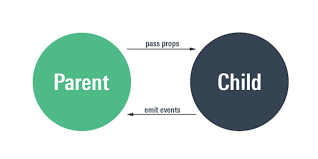

# what is props in React js ?

  1. props stands for properties pass in function as arguments i.e called props in React js 
 
    ```  
     function App(props)
     {
        statements;
     }
    ```
  2. props stands for properties 
  3. props pass data parent to child components
  4. props read only data (immutable) can not be changed 
  5. props access jsx data as attributes 

    ```
      <h1>Name is : {props.name}</h1>
      <h1>Id is  : {props.id}</h1>
      <h1>salary is  : {props.salary}</h1>

    ```

 **props architectures**
   1. pass data parent to child 

      ```
       parent => child 
    
      ```     

        

    or


    


    **examples of props**


    ```
    import React from "react";
    function EmployeeDetails(props)
    {
    return(
        <>
            <div className="app">
            <h1>The Name of employee : {props.name}</h1>
            <h3>The Age of employee : {props.age}</h3>
            <h5>The Salary of employee : {props.salary}</h5>
            <h6>The Address of employee : {props.name}</h6>
     
      </div>
        </>
       )
     }
 
    export default EmployeeDetails
   ```